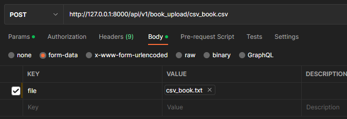
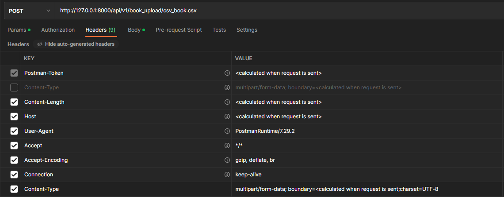

# REST API library сервис.

Стек: DRF, Docker, Postgres, Celery, Redis, Flower

## Установка
```
git clone https://github.com/KhalWell/Library.git
```
## Запуск:
```
docker-compose build
docker-compose up -d
```


## пользуемся API через swagger

```
http://0.0.0.0:8000/swagger/
или
http://127.0.0.1:8000/swagger/

'это все апи ручки'
```
## модели есть в админке

```
http://0.0.0.0:8000/admin/
или
http://127.0.0.1:8000/admin/

'будет создан супеюзер: login:admin, pass:admin'
```
### в проекте есть файл csv_book.txt

```
Это для пункта "Реализуйте функционал для импорта большого списка книг через CSV-файл. Этот процесс должен
выполняться асинхронно с использованием Celery."
  Файл дан как пример, не успел сделать валидаторы на файл и обработчики исключений
по этому файл должен быть в таком формате, так же в файле все записи на латинице, опять же
по тому, что не стал тратить время на работу с подбором кодировки
```

### Пункты задания:

```
  Библиотекарь может:
   Просматривать список книг и дополнять его:
GET api/v1/book/
POST api/v1/book/isnb (isbn) - > int
  o видеть кол-во остатков по книге;
GET api/v1/book/
GET api/v1/book/isnb
  o какие из них зарезервированы/взяты;
GET api/v1/order/
GET api/v1/order/id
  o если остатков нет, то, когда будет ближайший возврат.
GET api/v1/book/isnb (поле - "returned")
   Просматривать список читателей и дополнять его;
GET api/v1/book/
POST api/v1/book/
   Отмечать книги как взятые на прочтение/зарезервированные тем или иным читателем.
  отмечается в модели Order
```

### "Необходим механизм проверки того, есть ли книги, взятые более чем на 2 недели, чтобы отправлять
### уведомление о том, что книга не была возвращена."
```
  Немного не понял, что нужно сделать с книгами... (так-как у меня работа с книгами идет через заказ
то каждый день формируется queryset c просроченными возвратами и его можно уже и на почту отправить,
и в модель занести, и в кеш положить, lib/core/tasks.orders_with_dept()
  Само расписание настроенно в lib/settings/celery и поднят воркер 
```

### Реализуйте функционал для импорта большого списка книг через CSV-файл. Этот процесс должен
### выполняться асинхронно с использованием Celery.


```
не стал вешать на этот конкретный адрес пермиссии, для упрощения тестов
на картинках пример запроса
```

### Допущения/упрощения:
```
1) Так как проект тестовый времени писать валидаторы и тесты нет.
2) пермисси идут просто по названию группы
3) предполагается что читатель это пользователь без групп
```


